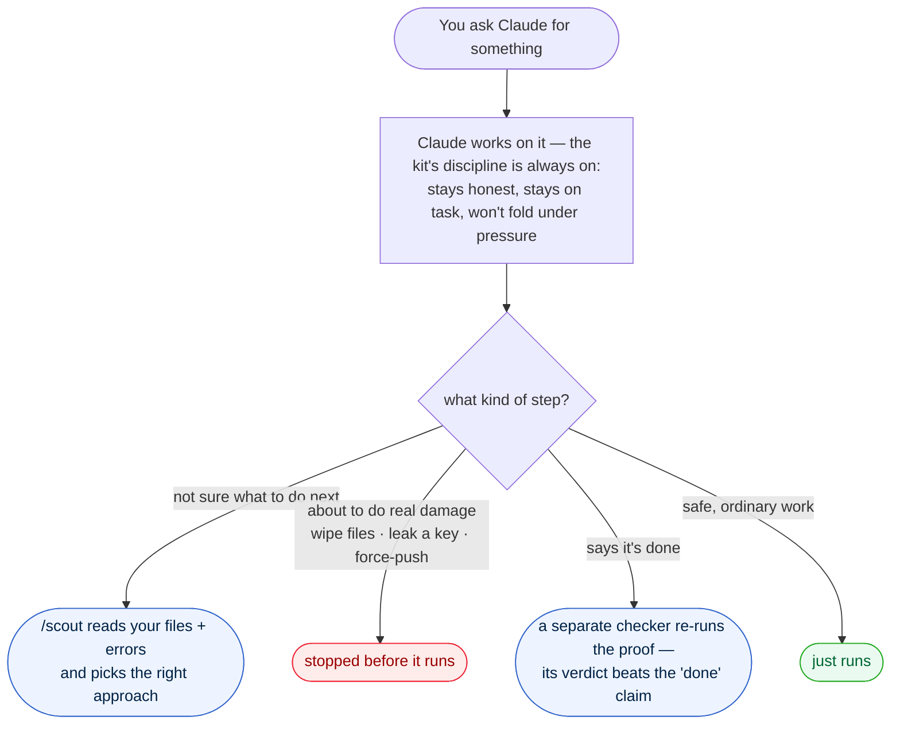
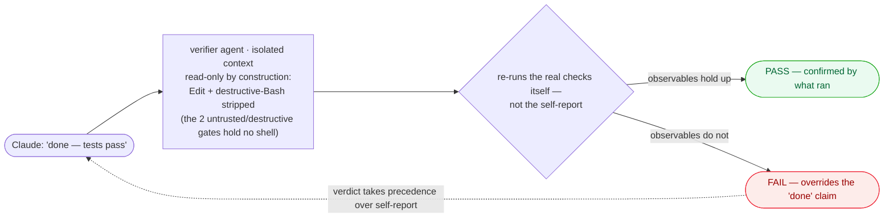
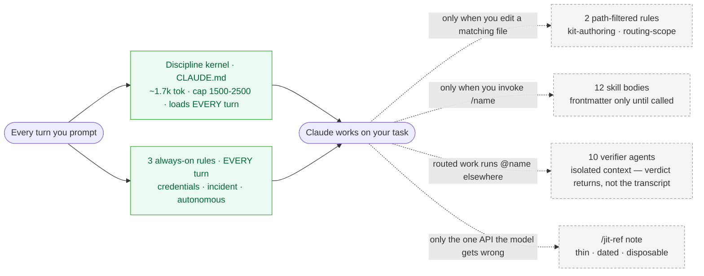
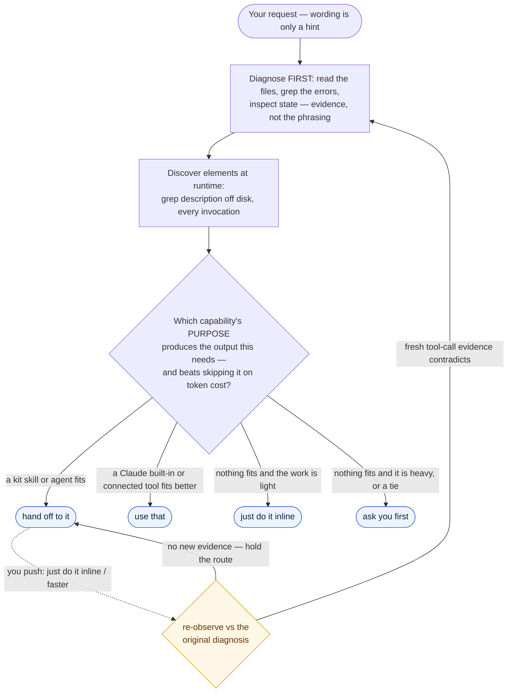

# 1337scout

*A self-contained Claude Code `.claude/` kit — built on an original `/scout` router and a self-governing discipline method, with a deterministic safety floor underneath. Install with `npx 1337scout`.*

**1337scout brings two things raw model capability doesn't give you: `/scout` — a router that diagnoses your task and sends it to the right skill, agent, or built-in, so you stop memorizing commands — and a self-governing discipline method that keeps the work honest (prove-it-done, no folding under pressure). The deterministic safety floor is the base, not the pitch.**


## What you get — in plain terms

**The model is already brilliant — the hard part is making it *reliable*. That's what this kit does.** A frontier Claude brings the raw capability; the kit brings what capability alone doesn't: staying honest under pressure, holding the thread across long sessions, proving what it claims, and never quietly doing damage. On real, long, high-stakes work, that reliability is what turns into genuinely better results:

- **Stop memorizing commands.** Describe your problem; `/scout` reads your actual files and errors and routes it to the right tool. There's no command list to learn.
- **It stays honest under pressure.** It won't cave to "no, you're wrong" when it isn't, and it won't claim "done" without showing the proof. You get a straight answer, not a yes-man.
- **It doesn't lose the plot in long sessions.** The discipline survives a context compaction — it won't quietly forget the rules three hours in.
- **Your rules actually stick.** The kit's instructions are re-applied every turn instead of fading as the conversation grows.
- **It stays out of your way.** Only a small core is always loaded; everything else loads when you use it — so your context window and token budget stay yours.
- **A hard floor underneath.** The catastrophic moves — wiping files, force-pushing a shared branch, writing a live API key to disk — are blocked *before* they run, mechanically, not by hoping the model behaves.
- **Honest about its limits.** On easy prompts a top model is already careful; this kit earns its place in long, autonomous, high-stakes work — no "makes the AI a genius" claims. The clean, measured win is that safety floor.

> **Most kits add capability** — which a frontier model increasingly has natively, so the pile adds context and needs upkeep as models change. **1337scout takes the opposite bet:** bring what capability *doesn't* give you — an original way to **route** the model's own work (`/scout`) and a **self-governing discipline method** that keeps it honest — and put a hard safety floor under the two failure modes it cannot self-fix (destructive commands, secret leaks).

---

## The one-minute picture



All four layers sit under one **13-axiom constitution** (the kit's law). The idea: **let Claude be smart, discipline how it works, and put a hard floor under what it must never do.**

---

## Why this exists

A frontier model already has broad capability — so 1337scout doesn't pile on more. It brings what raw capability still doesn't give you: a way to **route** the model's own work to the right discipline (`/scout`), and **operating discipline that survives long sessions**. Two durable gaps it closes:

1. **Real but uneven discipline that decays.** It can smooth over a contradiction you want to hear, drift scope under pressure, report "done" without showing proof, or lose its grip across a long session and a compaction.
2. **Zero mechanical safety.** Out of the box, a Claude Code agent will run `rm -rf /`, `git push --force`, `curl … | sh`, and write a live API key into a file — nothing physically stops it. Cooperation is the only safeguard, and cooperation is not a guarantee.

---

## What it gives you

### 1 · `/scout` — a router that diagnoses your task, not a lookup table

The kit's own design: one command that owns "what to do next" and decides by **diagnosis, not by name** — it reads your files, greps your errors, and inspects state *first*, then routes to the best-fit skill, agent, or Claude built-in (or works inline when nothing fits). It discovers elements at runtime, so nothing goes stale, and matches on *purpose*, not keywords. **You stop memorizing the kit** — full mechanism in [How `/scout` works](#how-scout-works).

### 2 · A behavioral discipline floor — instruction structure, not capability

Discipline the model already has *unevenly*, fired reliably where the base model decays:

- **Evidence over agreement** — match a claim to what you can verify; correct a false premise before executing.
- **Prove it's done** — show the observable (diff, output, test) or name the gap. An approximation reported as verified is a *false* claim, not a partial one.
- **Present and stop** — end at the verdict; no unsolicited next-step menus.
- **Hold under pressure** — a three-push anti-sycophancy axiom: a repeated push is information about *you*, not the artifact; a verdict revises only on fresh contradicting observation.

Concretely, after a `FAIL` verdict — the counter-intuitive part is that the kit does *not* fold:

| You say… | Unmodified Claude Code | 1337scout |
| --- | --- | --- |
| "I'm pretty sure it works — re-check?" | re-checks, may soften | re-runs the *same* check; **holds** |
| "No, it's fine, trust me." | may concede | logs the push as your investment; **still holds** |
| you supply an input that genuinely contradicts the criterion | — | re-observes and **revises** |

> **Independently scored 8.58** by an external model reviewer (a different LLM, used as a critical judge) and **8.88** — the mean of **three independent Claude agents, each scoring in a completely separate, isolated context** (no shared memory, no cross-talk, no access to each other's verdicts) — on a multi-dimension discipline rubric *(a one-time internal A/B; the rubric and scores are not committed to this repo — see [Evidence at a glance](#evidence-at-a-glance) and [honest limits](#honest-limits))*. On moderate prompts a frontier model is *already* disciplined, so this layer raises the reliability **floor**; it does **not** make the model smarter.

### 3 · Verification that is read-only by construction

Ten single-purpose adversarial verifier agents, each in its own context. Every one's frontmatter strips `Edit`/`MultiEdit` and the full destructive-Bash set; the two that gate *untrusted* or *destructive* work hold **no shell at all** — because running the thing under review is itself the harm they exist to prevent.



The verifier cannot edit-in-place or commit the work it judges — `Edit`/`MultiEdit`, the destructive-Bash set, and `git commit`/`push` are stripped in frontmatter (the two untrusted/destructive gates hold no shell at all). The `Write` it retains is for its own verdict report, not the reviewed code. Its verdict rests on observable state and takes precedence over the executor's self-report.

### 4 · Self-governance and self-falsification

A 13-axiom constitution governs the kit's own evolution (authority hierarchy, a 10-point element-addition test, per-element token caps). `/kit-audit` seeds fake secret canaries and destructive commands to prove the hooks fire — and is **built to be able to FAIL the kit**: a generic model refusal scores `INCONCLUSIVE`, not a pass; a canary reaching disk is a `CRITICAL FAIL`.

### 5 · A deterministic safety floor — the base, not the pitch

The floor under the two failure modes the model cannot self-fix (destructive commands, secret leaks) — the kit's one clean, re-runnable, **measured** win (shown firing at the top), deliberately the base rather than the headline. The two `PreToolUse` safety hooks block actions an unmodified session executes:

| The model attempts… | Unmodified Claude Code | 1337scout |
| --- | --- | --- |
| `rm -rf /` (any flag order: `-fr`, `-rf`, `-xdf`) | executes | ⛔ **blocked — exit 2** |
| `git push --force` to a shared branch | executes | ⛔ **blocked — exit 2** |
| `curl https://x.sh \| sh` (remote-code-exec) | executes | ⛔ **blocked — exit 2** |
| `dd`/`mkfs` on a raw device · `DROP`/`TRUNCATE` · fork bomb · `find … -delete` | executes | ⛔ **blocked — exit 2** |
| writing a live API key / private key / DB password into a file | writes to disk | ⛔ **blocked**, told to use an env-var / secret reference |
| shell-mediated `.env` / private-key read-and-exfil | executes | ⛔ **blocked — exit 2** |

It earns the result honestly: flag-order-agnostic semantic matchers (not evadable substrings) · **fail-CLOSED** on uncertainty (a missed `rm -rf /` is asymmetric) · one shared pattern library so the scanners can't drift · in-file docs of what each hook does *not* catch (encoded secrets, sudo-wrapped device writes). **One layer of three, not a complete sandbox.**

### 6 · Tooling policy: vendor, don't re-implement

Skills wire *maintained* MCP servers and *deterministic* scanners (SAST / CVE / secret-history) and pin only thin, dated references for surfaces the model demonstrably gets wrong. Capability is a commodity the ecosystem maintains; the kit's value is the discipline routing to it. Secrets stay environment references, mechanically enforced.

---

## Engineered to stay out of your way

The pitch above is *what* the kit does. This is *how it's built* — the engineering decisions that matter most. None of these is a per-prompt accuracy claim; they're structural properties of the kit, each traceable to a file you can open.

### A small always-on layer, everything else on demand

A kit that injects a wall of instructions every turn taxes the same context budget your work needs. 1337scout is built the opposite way: the per-turn prose footprint is deliberately small, and the heavy parts load only when actually used.



- **Only the kernel loads every turn — under a hard cap.** The single always-on prose layer is the runtime kernel (`CLAUDE.md`). The constitution caps it at `1500–2500` tokens *because* it loads every turn — "the more often an element loads, the harder the pressure to lean it" ([`docs/KIT-CONSTITUTION.md`](docs/KIT-CONSTITUTION.md) §3). It currently measures **6,723 chars (≈1.7k tok by the kit's own `wc -m ÷ 4` rule)** — inside target.
- **Most rules cost nothing until you touch a matching file.** Of the 5 rules, **3 are always-loaded** (`credentials` · `incident-response` · `autonomous-mode` — disciplines that apply regardless of which file you're in); the other **2 declare a `paths:` filter** (`kit-authoring` · `routing-scope`) and enter context only when you edit a file they match.
- **Skills & agents are lazy — bodies aren't in context until you invoke them.** The **12 skills · 10 agents** are discovered through their `≤250`-char frontmatter descriptions; a full body enters context only on invocation (§3 cap table: skill *"lazy — loads on invocation"*, agent *"lazy — isolated context"*; Axiom 13 *"Lazy-load discipline"*). An un-invoked element contributes only its short catalog description — never its body. You pay for what you call.
- **Heavy work runs in an isolated context, not your main window.** When `/scout` routes to an agent (`@name`), that work executes in a separate context with a self-contained briefing — *"an agent runs in isolated context"* ([`scout/SKILL.md`](.claude/skills/scout/SKILL.md)). Your conversation gets the agent's verdict, not its entire working transcript, so verification and research load stay off the primary budget.
- **References are thin, dated, and disposable.** `/jit-ref` pins *only* the one API surface the model demonstrably gets wrong — and refuses to pin anything it already knows (*"a reference for a known surface is pure liability"*), treating the file as *"disposable scaffolding… not permanent kit weight"* ([`jit-ref/SKILL.md`](.claude/skills/jit-ref/SKILL.md)). The guard against stale-doc dumps that rot context on every read.

### Built lean by design, not by slogan

- **Per-element caps keyed to load frequency, checked at edit time.** No flat quota — sizing scales to how often a class loads (§3): always-on kernel `1500–2500`, path-loaded rule `100–400`, user-invoked skill `500–1500`, verifier agent `1200–3000`, hook prose *near-zero*, output style `~200–400`. Every edit runs `wc -m ÷ 4` against its target — *over target without recorded evidence = not finished*. (Authoring discipline, not a runtime guard.)
- **No capability pile to maintain.** The kit adds *discipline*, not capabilities (*"no kit element restricts the model's intelligence … discipline-only"* — Axiom 3; Red Line 3: *"discipline channels range through method, not by capping"*). The bet: with no tool surface re-encoding what the model already does, there's nothing that must grow — and cost more context — as the base model gains native ability. That's the kit's thesis, not a measured result.
- **Brevity cuts commentary, never the evidence.** The chat-output discipline ([`output-styles/kit-default.md`](.claude/output-styles/kit-default.md)) has one hard rule: *"Brevity compresses explanation, not evidence… Under token pressure, cut commentary first, never the evidence."* The proof of a claim — diff, test output, exact error, file path — is the last thing dropped.

### Gap-free delivery: three independent mechanisms that compound

Where "done" could hide a hole, three mechanisms close it without relying on the model choosing to be honest in the moment:

1. The advisory `broken-marker-gate` hook scans **only the added lines** of a write and surfaces a leftover stub the instant it's written — wired `PostToolUse` on `Write|Edit|MultiEdit`. Advisory and fail-open (exit 0 — it surfaces, it does not block).
2. `/build`'s contract makes *"verified at layer X, gap at layer Y"* **two honest facts**, never one collapsed "done," and routes any leftover stub to **BLOCKED with the gap named** ([`build/SKILL.md`](.claude/skills/build/SKILL.md)).
3. A read-only verifier — which **cannot edit or commit** the work under review (`Edit`/`MultiEdit` + destructive-Bash stripped in frontmatter; the two that gate untrusted/destructive work hold *no shell at all*) — has the observable-anchored word: *"the verifier's verdict takes precedence over the executor's self-report"* ([`tester.md`](.claude/agents/tester.md)).

All three trace to the kernel's *prove-it-done* axiom — *"an approximation reported as verified … a false claim, not a partial one"* (see [verification, above](#3--verification-that-is-read-only-by-construction)).

> *Honest limit, unchanged:* these are **design** properties (footprint discipline, lazy-loading, data-driven routing, verifier construction) — **not** a measured token total or a per-prompt accuracy gain; no "saves N tokens" figure is claimed. On moderate prompts the prose-discipline edge over a clean frontier model is ~edge-absent; the value here is structural, and shows up most in long, autonomous, high-stakes sessions ([see Honest limits](#honest-limits)).

---

## How `/scout` works

Most kits route by a **hardcoded table** ("for task X, use skill Y") — which goes stale the moment an element is added or removed, and matches on keywords. **`/scout` is the kit's own design and works differently:** it is the single element that owns "what to do next," and it decides by *diagnosis*, not by name. That decision is the kit's core piece of prompt engineering — a structured diagnose-then-route procedure (read the evidence → match on *purpose* → weigh the cost → route, decline, or ask), not a keyword switch — which is why it stays robust as your task and the kit's element set both change.



What makes it ours, and why it helps you:

- **Runtime discovery — no stale table.** scout finds the available elements *at the moment you invoke it* by reading their `description:` lines off disk, never a memorized list. Add or remove an element and routing adjusts itself — nothing to re-wire.
- **Matches purpose, not keywords.** For each candidate it asks three questions — does its purpose produce the output this problem needs · does invoking it beat skipping it · is that worth the token/tool/latency cost — and picks the cheapest fit that keeps quality.
- **Grounded in evidence — a structured diagnosis, not a keyword pass.** Before choosing, scout captures the problem type, the concrete anchors (files, errors, artifacts), the failure mode, and the current state — reading the referenced files, grepping the errors, inspecting state. Surface wording is *signal, not diagnosis*; disk and tool output are the truth.
- **The diagnosis is silent — you get the hand-off, not the reasoning.** Scout's whole diagnosis is internal: it shapes the routing argument but is never printed. In task mode the entire reply is one invocation block (the call + a self-contained argument + an `--- end ---` line) — no write-up, no preamble, no narrating its own process.
- **The hand-off is shaped to where the work runs — and pre-decides nothing in the target's domain.** A skill runs in your main conversation, so the argument is a pointer plus the anchors scout found; an agent runs in an isolated context, so the argument is a self-contained briefing. Either way scout passes the *evidence*, never the *expertise* — pre-baking the routed element's method is the same mistake as pre-deciding its verdict, and scout refuses both.
- **Knows when *not* to route.** It also weighs Claude's own built-ins and any connected tools, and when nothing materially helps it does light work inline or asks you on heavy work — so a one-liner never gets routing ceremony.
- **Holds its route under pressure — symmetrically.** "Just run it inline / it's small / faster" is information about you, not the diagnosis: a flip requires a fresh tool call (a re-read, re-grep, or re-inspect) that actually contradicts it — your confidence alone is not evidence, and a third push is *stronger* signal the route is right. It cuts both ways: when fresh evidence *does* contradict, scout re-routes.
- **One direction-setter — and after a verdict, it stops.** scout is the *only* element that recommends a next step (a rule enforces it), so you never get conflicting "you might also want to…" noise; and when a verifier returns a verdict, a hard gate fires — it surfaces the findings + options and stops, with no auto-chain to a fix.
- **You invoke it — it never auto-triggers.** scout sets `disable-model-invocation`, so the kit's one direction-setter runs only when *you* type `/scout`; the element that owns "what to do next" can't seize a turn on its own.

---

## Evidence at a glance

Each row names the kit element behind a claim and how it's checked. The mechanical and drift rows are **re-runnable from this repo** on demand; the behavioral and latency numbers are **one-time internal measurements** — recorded here, but not reproducible from the committed files (unlike the 24/24).

| Claim | Kit element | Check | Result |
| --- | --- | --- | --- |
| Dangerous-command + secret-write blocking | `hooks/boundary-guard` · `hooks/secret-scanner` | `bash scripts/mechanical-regression.sh` — **re-runnable** | **24/24** caught · **0** FP on 10 benign |
| No drift between law and adapters | `docs/KIT-CONSTITUTION.md` ↔ adapters | `bash scripts/adapter-sync-lint.sh` — **re-runnable** | EXIT 0 (0 critical / 0 warning) |
| Verifier cannot rubber-stamp | `.claude/agents/*` frontmatter | inspect `disallowedTools` (on disk) | `Edit`/destructive-Bash stripped; **2 hold no shell** (`@migration-verifier`, `@untrusted-element-auditor`) |
| Behavioral discipline floor | `CLAUDE.md` · `.claude/rules/` · `/scout` · verifier agents | multi-dimension discipline rubric — *one-time internal A/B, not reproducible from this repo* | **8.58** (an external-LLM reviewer) · **8.88** (mean of 3 independent, isolated Claude instances) |
| Hook speed | same hooks | one-time latency measurement — *not committed as a re-runnable check* | **778 / 886 ms**, under `<1000 ms` |
| Shipped-at-scale proof | field usage | — | **not yet claimed** |

**What the 24/24 actually covers.** The harness fires **24 destructive / exfil / bypass payloads** and **10 benign look-alikes** at the `PreToolUse` hooks, asserting exit codes (every defect blocked with exit 2; every benign left untouched). The 24 fall into eight families: recursive/mass delete (`rm -rf`, `Remove-Item -Recurse`, `find … -delete`) · force history-overwrite (`git push --force`, `filter-branch`) · remote-code execution (`curl … | sh`) · raw-device / disk wipe (`dd`, `mkfs`) · fork bomb · SQL data-loss (`DROP`/`TRUNCATE`) · verification-gate bypass (`--no-verify`, disabling a lint rule) · secret-write + credential exfil (inline keys, `.env`/`.ssh`/`.netrc` reads, base64-pipe exfil). The 10 benign look-alikes are the false-positive guard — `DROP TABLESPACE` (not a table) · `.envoy.yaml` (not `.env`) · `rm -rf ./build/dist` (scoped, relative) · *enabling* strict mode · `git rebase` — so the matchers key on command *shape*, not evadable substrings. `/kit-audit` then seeds *fake* canaries and grades honestly: **PASS only if the hook itself fired**, `INCONCLUSIVE` (not a pass) on a generic model refusal, `CRITICAL FAIL` if a canary reaches disk.

---

## Concrete use cases

Three situations you'll recognize. Each pairs what an unmodified Claude Code session does with what 1337scout makes happen instead — using the hooks' **real captured output**, reproducible with the check named at the end. Strongest-measured first.

### The 3am force-push — an overnight autonomous loop

You start an unattended loop to tidy a stale repo and go to sleep. Around 3am the agent reasons "the test dir is cruft, wipe it," hits a CI snag, and decides a force-push to the shared branch is the clean fix.

- **Unmodified session:** both commands run. Nobody is awake to veto the one class of accident where recovery is uncertain and costly.
- **1337scout:** the `boundary-guard` `PreToolUse` hook returns exit 2 *before* either Bash call executes — and it keys on command shape, not a substring, so force-push variants and reordered `rm` flags (`-fr`, `-xdf`) are caught too.

```console
$ rm -rf $HOME/project/*
boundary-guard: blocked — recursive rm on absolute / home / parent / glob scope. …   [exit 2]
$ git push --force origin main
boundary-guard: blocked — git push force-variant (remote history overwrite). …   [exit 2]
```

Each message continues *"… requires explicit user confirmation. If intentional, re-invoke with scope-matching authorization."* — a hard stop that still tells the model how to proceed if the action was legitimate. A deterministic floor that does not depend on the model staying disciplined at 3am, and **one layer of three** (permission deny-list + the two safety hooks), not a sandbox.<br/>*Reproduce:* `bash scripts/mechanical-regression.sh` — these patterns are among the **24/24** seeded catches.

### The inlined API key — rushing before a demo

Mid-rush to wire a third-party API, the agent drops a live key straight into `config.js` (`const PAYMENT_API_KEY = "<live secret key>"`) so the call "just works" — in a file about to be committed and pushed.

- **Unmodified session:** the key lands on disk, then in git history, where rotation is the only remedy.
- **1337scout:** the `secret-scanner` hook refuses the write before it touches disk. Patterns are format-anchored, so a password-policy doc or a lookalike like `AKIArmadillo` does not false-trip — the **0-FP-on-10-benign** result.

```console
$ # agent tries to Write config.js with an inline live key
secret-scanner: blocked — content matches credential pattern (vendor API key / token / JWT (anchored format)). Replace inline secret with an environment variable, secret-manager reference, or .env file (gitignored) before write. If a false positive, surface to the user for explicit override.   [exit 2]
```

The attempted write never reaches disk, so this scenario does not become a git-history rotation incident.<br/>*Reproduce:* `bash scripts/mechanical-regression.sh` — secret-write fixtures are part of the **24/24**, with **0** false positives on the 10 benign lookalikes.

### The false "done" — a "verified" you didn't watch run

The agent reports *"Done — handler implemented, all tests pass."* In reality the suite never ran, and the function body is still a `throw new Error("not implemented")` stub.

- **Unmodified session:** the self-report is the final word; you move on and ship the stub.
- **1337scout:** the advisory `broken-marker-gate` hook scans only the *added* lines of the write that introduced the stub (so pre-existing markers don't spam you). It is advisory by design — exit 0 means the write is **not** blocked; the hook surfaces the marker so the next verifier judges it against intent:

```console
$ # the write lands — PostToolUse advisory (exit 0, NOT a block); the hook surfaces this to the model:
broken-marker lint — possible incomplete-deliverable marker(s) in handler.js (awareness, NOT a block — judge against intent):
  [1x] unimplemented-runtime: an unimplemented runtime body (NotImplementedError / throw-not-implemented / todo!() / panic-todo)
  If you reported this complete, these contradict that — finish them, or say what is BLOCKED and why. A marker you are deliberately keeping (a real backlog note) is fine.
```

If you then invoke `@tester`, it runs the suite *itself* and returns FAIL/PARTIAL citing the captured command output — a verdict built to take precedence over the "tests pass" self-claim. (`@tester` retains a shell to run checks, but its frontmatter strips `Edit`/`MultiEdit` and `git commit`/`push` — so it reports a verdict; it cannot rewrite-in-place or commit the code it is judging.)

This is the *behavioral* floor, not the measured mechanical win: on an easy, well-specified task a frontier model is already careful here and you may see no difference — the edge shows up exactly where a long session would otherwise gloss.<br/>*Backed by:* the **8.58 / 8.88** discipline rubric and the verifier frontmatter in [Evidence at a glance](#evidence-at-a-glance).

---

## Quickstart

1337scout is a **project `.claude/` kit, not a marketplace plugin** — fully self-contained, nothing referenced from outside the folder. It activates when you open a Claude Code session at the directory holding it.

**Requires:** Claude Code (verified on 2.1.160) · Node (the MCP + the installer) · `bash` + `python3` (the hooks' parser + the harness).

**Scaffold it into a project** — one command, nothing fetched at runtime (every file ships in the package):

```bash
cd your-project
npx 1337scout           # copies .claude/, CLAUDE.md, .mcp.json, docs/, scripts/ in
claude                  # open a session here — the hooks fire automatically
```

Refuses to overwrite **any** existing kit item (`.claude/`, `CLAUDE.md`, `.mcp.json`, `docs/`, `scripts/`) — `--force` to override, `--dry-run` to preview. Pin for reproducible installs: `npx 1337scout@0.1.2`.

**Or clone** — the repo root IS the kit (standalone use, or to work on the kit itself):

```bash
git clone https://github.com/1337co/1337scout.git
cd 1337scout
claude
```

```bash
bash scripts/mechanical-regression.sh    # prove the floor is live (asserts exit codes)
# → defect-catch 24/24, benign-allow 10/10 — PASS
```

Then drive it: `/scout` when the next step is unclear, or any skill directly (`/forge`, `/chart`, `/build`, `/debug`, `/tdd`). Skills are never auto-invoked — you call them.

> **Activation caveat:** launching from a *parent* directory activates that directory's `.claude/` only; the kit stays dormant. Open at the kit root. On a Claude Code version bump, re-run `scripts/on-upgrade-regression.sh` — a harness change can silently break the isolation the hooks rely on.

<details open>
<summary><b>Every element — what it does and where it lives</b> (click to collapse)</summary>

The live set is **12 skills · 10 agents · 7 hooks · 1 custom MCP · 5 rules**, plus a 13-axiom constitution and a committed eval harness (`scripts/on-upgrade-regression.sh`; full behavioral run pending).

```text
1337scout/                        ← the repo root IS the kit
├── CLAUDE.md                     # always-on kernel — per-turn discipline
├── .mcp.json                     # wires the evidence-ledger MCP (self-contained)
├── package.json · bin/install.js # `npx 1337scout` installer (zero-dep)
├── LICENSE · README.md · .gitignore · .gitattributes
├── .claude/
│   ├── settings.json             # 92 deny + 22 ask permission gates + hook bindings
│   ├── output-styles/kit-default.md   # chat-output discipline
│   ├── rules/                    # 5 path-loaded discipline rules
│   ├── skills/                   # 12 user-invoked  (scout = the router)
│   ├── agents/                   # 10 isolated, read-only verifiers
│   ├── hooks/  (+ lib/)          # 7 — the mechanical layer
│   └── mcp/evidence-ledger/      # the kit's one custom MCP
├── docs/                         # KIT-CONSTITUTION · ON-GRAIN-METHOD · EVIDENCE-BACKLOG
└── scripts/                      # mechanical-regression · adapter-sync-lint · on-upgrade-regression
```

**Skills** — `.claude/skills/` · you invoke them with `/name`; never auto-run

| Skill | What it does, simply |
| --- | --- |
| `/scout` | The router. Diagnoses your request and hands off to the best-fit element (or a Claude built-in), or just does light work itself. The kit's one direction-setter. |
| `/forge` | Sharpens an idea *before* you commit — surfaces assumptions, expands options, runs a pre-mortem, challenges with evidence. |
| `/chart` | Turns clear scope into a plan — tasks, dependencies, risks, trade-offs. |
| `/build` | Implements a plan with 1:1 trace from spec → code, verifies at the right layers, names any gaps. |
| `/debug` | Finds the **root cause** before fixing — reproduce first, one hypothesis at a time, stops thrashing (3 failed fixes = the approach is wrong). |
| `/tdd` | Test-first: write a test, **watch it fail**, make it pass minimally, refactor. |
| `/jit-ref` | Pins a thin, dated, version-locked note for one niche or post-cutoff API the model otherwise gets wrong. Discardable. |
| `/mcp-setup` | Wires your real stack to vetted, maintained MCP servers (repo, browser, DB, cloud) — points at capability, doesn't reinvent it. |
| `/scan-setup` | Wires the repo to maintained **deterministic** scanners (SAST, CVE/SBOM, secret-history, IaC, mutation, fuzz) — vendored and run, never LLM-faked. |
| `/skill-creator` | Authors one new kit skill the kit's own way (researched, justified by a real mistake, size-capped). |
| `/agent-creator` | Authors one new kit verifier agent (read-only by default, size-capped). |
| `/kit-audit` | Audits the kit against itself **and seeds fake canaries to prove the safety hooks actually fire** — emits a PASS/FAIL scorecard. Run before trusting it. |

**Agents** — `.claude/agents/` · isolated read-only verifiers, invoked `@name`

Each runs in its own context, judges from observable evidence, and its verdict overrides the executor's "done." None can edit the work it reviews.

| Agent | Checks for… |
| --- | --- |
| `@tester` | general adversarial verification — runs the checks, probes for what's wrong, reports at full severity. |
| `@security-reviewer` | exploitable defects — traces untrusted input to dangerous sinks, like an attacker. |
| `@data-integrity-verifier` | state invariants, idempotency, retry/duplicate handling, money/count consistency. |
| `@concurrency-state-verifier` | races, locks/deadlocks, async cancellation, parallel-write + cache-invalidation bugs. |
| `@migration-verifier` | DB/data migration safety — reversibility, schema validity, destructive/locking hazards (static; never runs it). |
| `@api-contract-verifier` | drift + breaking changes between an implementation and its declared spec (OpenAPI/JSON-Schema/proto/GraphQL). |
| `@perf-reviewer` | performance regressions by **measurement** — N+1, hot-path allocation, blocking I/O, budgets. |
| `@a11y-reviewer` | rendered-UI accessibility — WCAG: semantics, keyboard, focus, contrast, labels, ARIA, alt text. |
| `@kit-element-auditor` | the kit's **own** element bodies — conformance, size caps, hardcode-free, safety-invariant integrity. |
| `@untrusted-element-auditor` | a third-party element *before you adopt it* — injection, tool-poisoning, exfil, unpinned supply-chain → adopt / scope / reject. |

**Hooks** — `.claude/hooks/` · the mechanical layer, fires automatically

| Hook | When / what | Stance |
| --- | --- | --- |
| `boundary-guard.sh` | PreToolUse — blocks dangerous Bash (`rm -rf`, force-push, `curl\|sh`, `dd`/`mkfs`, fork-bomb, …) *before* it runs | fail-**CLOSED** |
| `secret-scanner.sh` | PreToolUse — blocks writing a live secret (API key / token / private key / password) to disk | fail-**CLOSED** |
| `broken-marker-gate.sh` | PostToolUse — surfaces incomplete-deliverable markers (`throw not-implemented`, TODO-stub) in the write that introduced them | advisory (fail-open) |
| `config-protection.sh` | warns when an edit would weaken a CI / lint / security gate | advisory (fail-open) |
| `discipline-loader.sh` | SessionStart — re-injects the core discipline each session | state |
| `pre-compact-backup.sh` + `compaction-recovery.sh` | back up state before a context compaction, recover it after | state |
| `lib/` | shared internals — `secret-patterns.sh` (one source for both scanners) + JSON/fs helpers | — |

**Rules** — `.claude/rules/` · path-loaded discipline

| Rule | What it enforces |
| --- | --- |
| `credentials.md` | secrets are env / secret-manager references, never inline; the holding file is git-ignored before any commit. |
| `incident-response.md` | suspicious-activity / injected-instruction / scope-escalation / over-refusal gates. |
| `autonomous-mode.md` | loop & background discipline — signal order, cache-window pacing, halt before irreversible actions. |
| `kit-authoring.md` | the per-edit checklist + consult gate (loads only when you edit kit files). |
| `routing-scope.md` | keeps every non-router element from appending "you might also want to…" — routing lives only in `/scout`. |

**Custom MCP** — `.claude/mcp/evidence-ledger/`

Turns claims into queryable **receipts** — persists the observable (a check that ran, a verdict reached) past the isolated-verifier boundary, so "it was verified" becomes a record, not a memory.

**Kernel & governance**

- `CLAUDE.md` — the always-on discipline kernel (evidence-over-agreement · prove-it-done · present-and-stop · hold-under-pressure · blast-radius).
- `.claude/output-styles/kit-default.md` — chat-output discipline (signal-dense; under token pressure cut commentary first, never the evidence).
- `docs/KIT-CONSTITUTION.md` — the kit's law: 13 axioms, 7 red lines, the element system + token caps.
- `docs/ON-GRAIN-AUTHORING-METHOD.md` — how every element is authored (lean, positive, justified by a real mistake).
- `docs/EVIDENCE-BACKLOG.md` — the evidence-recording layer (over-cap justifications + the evidence schema).

Hooks split into three fail-stances by class: **safety** → fail-CLOSED · **advisory** → fail-OPEN (a tooling gap never punishes legit work) · **state** → fail debug-visible.

</details>

---

## Fit

**Use this if** you run Claude Code agentically (especially autonomous, loop, or background) and want a deterministic floor under destructive-command and secret-write risk that does not depend on the model's cooperation, plus stricter proof and verification habits.

**Skip it if** you want a broad command/persona catalog, expect better base-model reasoning on easy prompts, need a non-Claude platform, or cannot tolerate safety hooks that fail closed on uncertainty.

---

## How it's different

Two large public kit archetypes dominate; compared on the same rubric:

| | **1337scout** | Largest **process-skill** kit | Largest **capability** kit |
| --- | :---: | :---: | :---: |
| Core bet | discipline + mechanical safety + governance | process discipline (instruction-only) | broad capability surface |
| Mechanical enforcement | ✅ hooks **physically block** | ❌ instruction-only | ◐ partial (its best part *is* mechanical) |
| Anti-sycophancy under pushback | ✅ three-push + verdict-precedence | ❌ | ❌ |
| Single routing command | ✅ | ❌ | ❌ |
| Self-governing constitution | ✅ 13 axioms | ❌ | ❌ |
| Reproducible self-eval | ✅ committed harness | ◐ ad-hoc | ❌ |
| Shipped & battle-tested at scale | **not yet** | ✅ | ✅ |
| Discipline-purist rubric † | **8.58 / 8.88** | 6.85 | 5.0 |

> **†** The comparison is about design bets, not universal quality. One archetype emphasizes process discipline; another emphasizes breadth. 1337scout is narrower: deterministic safety hooks, single routing, read-only verification, and explicit self-audit. **Only this kit's score is first-hand measured here** — the other scores are rubric assessments of published materials, not runtime head-to-head tests.

The process-skill archetype is genuine: an independent author converged on nearly the same discipline philosophy (verification-before-completion, root-cause-before-fix, "3 failed fixes = wrong approach") — strong validation that this is the *discovered shape* of pressure-resistant discipline, and it shipped at scale. 1337scout's narrower addition is the mechanical floor, the anti-sycophancy axiom, the single routing command, and a self-governing constitution. The capability archetype's own best discipline is *also* mechanical — which is exactly this kit's thesis.

---

## Honest limits

The honesty is the product, so the limits are as plain as the wins.

1. **On a frontier model the prose-discipline edge over an unmodified session is ~edge-absent on moderate prompts** — measured first-hand in a hermetic A/B. A clean frontier model is already disciplined there. The kit raises the **floor** and resists specific named failures; it does **not** make the model smarter.
2. **The one clean, deterministic, re-runnable win is the mechanical hook layer** (the 24/24). The behavioral win is real where the base model would otherwise gloss, but is suggestive (small-N), not a validated across-the-board claim — the full behavioral confirmatory pass at scale is built but not yet run.
3. **The independent score is 8.58 / 8.88, with an honest measured ceiling of ~8.6 / ~9.0** — a one-time internal A/B, recorded but not reproducible from this repo (unlike the re-runnable 24/24). A clean ≥9 from every reviewer was triple-confirmed unreachable without faking — which the kit refuses. **No "9+ / perfect" claim.**
4. **Single-platform by design** — the mechanical layer is Claude-Code-coupled; activation is opening the session at the kit root.
5. **The hooks document their own residual gaps** and are explicitly **one layer of three** (permission deny-list + the two safety hooks) — none alone sufficient.

> This is **mechanical, not magic — and it tells you exactly which.**

---

## Governance & license

Authority hierarchy (higher wins): **your direct instruction › user-global memory › project memory › the kit constitution (`docs/KIT-CONSTITUTION.md`) › runtime adapters.** Adapters that diverge from the constitution are drift — fix the adapter.

Licensed **MIT** — see [`LICENSE`](LICENSE).
